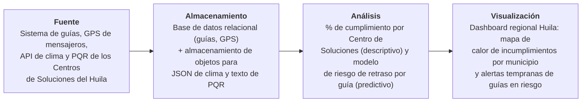

# Parcial Práctico · Corte 1
## Diagnóstico de datos de un proceso — Caso aplicado: Servientrega (regional Huila)

**Autor:** Cristian Camilo Quiguanas Ossa
**Facultad de Ingeniería, Corporación Universitaria del Huila (CORHUILA)**
**Ciencia de Datos · Electiva VI · 2026-B**
**Septiembre de 2026**

---

## 1. Cuatro tipos de datos y su clasificación

| # | Fuente / campo | Descripción concreta en el caso | Clasificación | Por qué pertenece a esa categoría |
|---|---|---|---|---|
| 1 | Sistema de guías y trazabilidad | Número de guía, Centro de Soluciones de origen, municipio de destino, fecha/hora de admisión y fecha/hora real de entrega | **Estructurado** | Cada registro sigue siempre el mismo esquema fijo de columnas (tabla relacional); no cambia campo a campo entre una guía y otra. |
| 2 | GPS del vehículo o dispositivo del mensajero | Latitud, longitud, velocidad y marca de tiempo del recorrido de reparto en tiempo real | **Estructurado** | Es un flujo de eventos con un formato numérico y de tiempo fijo (lat, lon, timestamp), fácilmente tabulable en una base de series de tiempo. |
| 3 | API meteorológica (clima en vías del Huila) | Lluvia, visibilidad y alertas de deslizamiento sobre la ruta de entrega, consultadas al momento del despacho | **Semiestructurado** | Llega en formato JSON con etiquetas (`temperatura`, `precipitación`, `alertas`), pero sin una tabla rígida: los campos y su anidación pueden variar entre respuestas de la API. |
| 4 | Registros del call center / chat de PQR | Texto libre de quejas de clientes sobre retrasos en la entrega en el Huila | **No estructurado** | Es lenguaje natural sin un esquema predefinido de columnas; el contenido y la extensión de cada queja varían por completo de un cliente a otro. |

**Resumen:** 2 estructurados, 1 semiestructurado, 1 no estructurado, cubriendo las tres categorías con fuentes reales de la operación.

---

## 2. Preguntas de analítica

**Pregunta descriptiva (¿qué pasó?):**
> ¿Qué porcentaje de las guías despachadas desde los Centros de Soluciones de Servientrega en el Huila fueron entregadas dentro de la ventana de tiempo prometida ("Hoy Mismo" / "Ya Mismo") durante el último mes, discriminado por municipio de destino?

**Pregunta predictiva (¿qué es probable que pase?):**
> Dada la hora de despacho, el municipio de destino y el pronóstico del clima sobre la ruta, ¿qué tan probable es que una guía específica de Servientrega en el Huila no cumpla su ventana de entrega prometida?

---

## 3. Diagrama del flujo de datos

---

## 4. Descriptive vs. Predictive Analytics (English)

In Servientrega's Huila operation, descriptive analytics looks backward: it summarizes historical tracking data to show what percentage of shipments were actually delivered within the promised time window last month, broken down by municipality. Predictive analytics looks forward instead: it uses variables such as dispatch time, destination, and the weather forecast along the route to estimate, before a shipment even leaves the warehouse, how likely that specific delivery is to miss its promised window.

---

## Fuentes

- Bienpensado. (2014). *Breve historia de las marcas: Servientrega*. https://bienpensado.com/historia-marca-servientrega/
- Encolombia. (2020). *Servientrega es Colombia, cobertura de Servientrega*. https://encolombia.com/economia/empresas/logistica/servientrega-es-colombia/
- Semana. (2023). *La empresa que revolucionó la mensajería en Colombia y hoy entrega paquetes en minutos*. https://www.semana.com/hablan-las-marcas/articulo/la-empresa-que-revoluciono-la-mensajeria-en-colombia-y-hoy-entrega-paquetes-en-minutos/202300/
