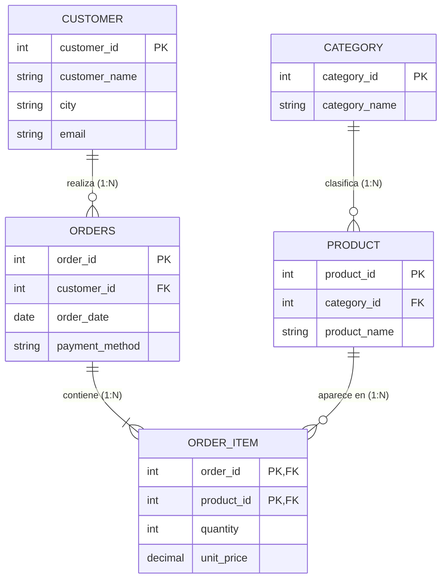

# c2-activity · Modelo, consulta y limpieza de datos

**Autor:** Cristian Camilo Quiguanas Ossa · Ingeniería Mecatrónica, Corhuila · Electiva de Ciencia de Datos 2026-B

**Caso de uso:** pedidos de una tienda de electrónica (sensores, microcontroladores, actuadores y accesorios).

## 1. Diagrama Entidad-Relación (ERD)



**Cardinalidades:** Cliente–Pedido **1:N**; Categoría–Producto **1:N**; Pedido–Producto **N:M**, resuelta con la tabla intermedia `ORDER_ITEM` (Pedido–Ítem 1:N y Producto–Ítem 1:N).
El CSV de trabajo (`pedidos_raw.csv`) es la versión desnormalizada (una fila por pedido con un solo producto) de este modelo.

## 2. Limpieza con pandas

Scripts: `generate_dataset.py` (crea `data/pedidos_raw.csv`, semilla fija) y `clean_and_query.py` (limpieza + consultas).

| Paso | Estrategia |
|---|---|
| Nulos `order_date` (5) | **Eliminación**: sin fecha no hay análisis temporal |
| Nulos `unit_price` (18) | **Imputación** con la moda del precio del mismo `product_id` |
| Nulos `city` (33) y `email` (27) | **Imputación** con el valor del mismo `customer_id` |
| Nulos `quantity` (24) | **Imputación** con la mediana |
| Nulos `payment_method` (20) | **Imputación** con `desconocido` |
| Duplicados | 25 filas repetidas eliminadas (`drop_duplicates` por `order_id`) |
| Tipos | Fechas con 3 formatos → `datetime`; `unit_price` ("$14,000") → `float`; ids y cantidad → `int`; `city`, `category`, `payment_method` → `category` |
| Formatos | `strip`, espacios múltiples, minúsculas (email, categoría, medio de pago) y `Title Case` (nombres, ciudades, productos) |

### Reporte Antes / Después

| Métrica | Antes | Después | Cambio |
|---|---:|---:|---:|
| Filas | 425 | 395 | -30 (25 duplicados + 5 sin fecha) |
| Columnas | 12 | 12 | 0 |
| Nulos totales | 127 | 0 | -127 |
| Duplicados | 25 | 0 | -25 |
| Columnas con tipo corregido | – | 10 de 12 | – |

| Columna | Nulos antes | Nulos después |
|---|---:|---:|
| order_date | 5 | 0 |
| city | 33 | 0 |
| email | 27 | 0 |
| unit_price | 18 | 0 |
| quantity | 24 | 0 |
| payment_method | 20 | 0 |

## 3. Consultas y hallazgos

### Pregunta 1: ¿Qué categorías generan más ingresos en pedidos grandes (`quantity >= 3`) y cuál es su ticket promedio?

```python
q1 = (df[df["quantity"] >= 3]
      .groupby("category", observed=True)
      .agg(pedidos=("order_id", "count"), ingresos=("total", "sum"), ticket_promedio=("total", "mean"))
      .round(0).sort_values("ingresos", ascending=False))
```

| category | pedidos | ingresos | ticket_promedio |
|---|---:|---:|---:|
| microcontroladores | 64 | 11,044,000 | 172,562 |
| actuadores | 56 | 2,890,000 | 51,607 |
| accesorios | 59 | 2,129,000 | 36,085 |
| sensores | 61 | 1,663,000 | 27,262 |

**Hallazgo:** los cuatro grupos tienen un número de pedidos parecido (56 a 64), pero los microcontroladores generan unas 6,6 veces más ingresos que los sensores por su precio unitario. El ingreso depende del precio del producto y no del volumen de pedidos; conviene priorizar el inventario de microcontroladores.

### Pregunta 2: ¿Cómo se distribuyen los ingresos por ciudad y medio de pago en pedidos de microcontroladores?

```python
q2 = (df[df["category"] == "microcontroladores"]
      .pivot_table(index="city", columns="payment_method", values="total",
                   aggfunc="sum", fill_value=0, observed=True, margins=True, margins_name="TOTAL")
      .sort_values("TOTAL", ascending=False))
```

| city | efectivo | nequi | tarjeta | transferencia | desconocido | TOTAL |
|---|---:|---:|---:|---:|---:|---:|
| **TOTAL** | 2,882,000 | 2,618,000 | 3,464,000 | 3,650,000 | 520,000 | 13,134,000 |
| Neiva | 1,442,000 | 1,108,000 | 1,598,000 | 1,344,000 | 156,000 | 5,648,000 |
| Pitalito | 190,000 | 1,112,000 | 440,000 | 1,364,000 | 260,000 | 3,366,000 |
| La Plata | 436,000 | 232,000 | 990,000 | 630,000 | 0 | 2,288,000 |
| Garzón | 814,000 | 166,000 | 436,000 | 312,000 | 104,000 | 1,832,000 |

**Hallazgo:** Neiva concentra cerca del 43 % de los ingresos en microcontroladores (5,65 de 13,13 millones). Transferencia (27,8 %) y tarjeta (26,4 %) son los medios más usados en total, y Pitalito casi no usa efectivo (190,000), mientras que en Garzón pesa más (814,000). Los pagos digitales dominan, así que conviene reforzar esos canales.

> Nota: los datos son sintéticos (semilla 42), por lo que los hallazgos ilustran el método y no describen un negocio real.

## Data & cleaning

This project uses a synthetic dataset of 425 orders from an electronics store, with 12 columns covering customers, cities, products, categories, prices, quantities, order dates and payment methods. The raw file contained 127 missing values, 25 duplicated orders, dates written in three different formats and prices stored as text with currency symbols. Using pandas, I normalized text (trimmed whitespace and unified letter case), converted ten columns to proper data types, removed the duplicates, dropped five rows without a date, and imputed the remaining nulls using the product, the customer, the median or a placeholder value. After cleaning, the dataset has 395 rows and no missing values. The first question asked which product categories generate the most revenue in large orders (quantity of three or more), and the answer was that microcontrollers lead by a wide margin because of their higher unit price. The second question analyzed microcontroller revenue by city and payment method, and it showed that Neiva concentrates about 43% of the revenue and that digital payments such as bank transfers and cards dominate.
